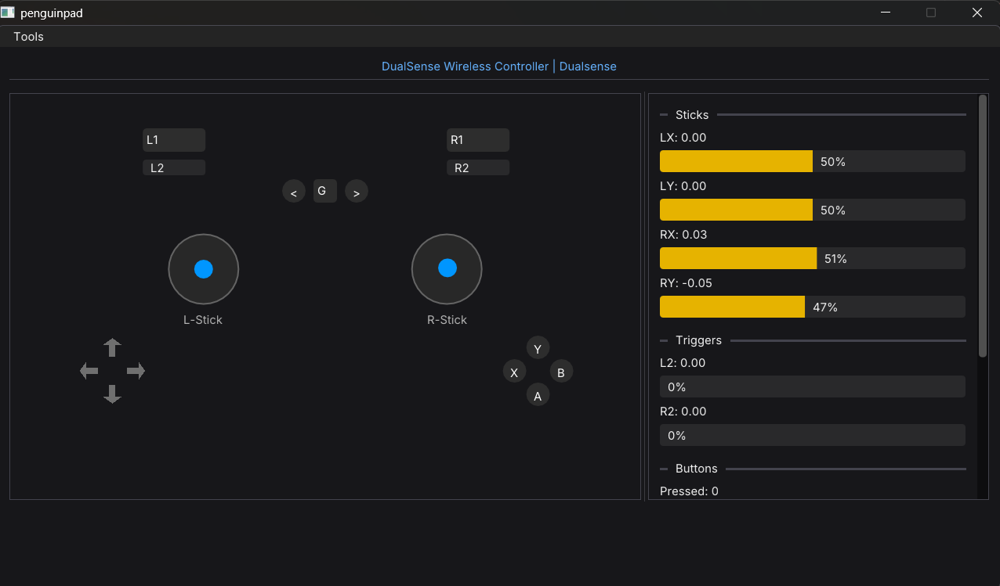

# PenguinPad

[](https://opensource.org/licenses/MIT)
[](https://isocpp.org/)
[](https://www.libsdl.org/)

A lightweight and efficient tool to test gamepad inputs, developed in C++.



## Features

- ✅ **Real-time Detection** - Instantly identifies when a controller is connected or disconnected
- 🎮 **Visual Mapping** - Visualize buttons, analog sticks (axes), and triggers through an intuitive UI
- ⚡ **SDL3 Support** - Leverages the latest hardware management improvements from SDL3
- 🚀 **High Performance** - Minimal resource footprint thanks to ImGui's immediate mode rendering
- 🪟 **Windows Native** - Optimized for Windows with native GUI integration

## Getting Started

### For Users - Download Prebuilt Executable

If you just want to use PenguinPad, simply download the latest portable executable from the [Releases](https://github.com/dnxbatista/penguinpad/releases) page:

1. Go to [PenguinPad Releases](https://github.com/dnxbatista/penguinpad/releases)
2. Download `penguinpad-portable.zip`
3. Extract the ZIP file
4. Run `penguinpad.exe`

That's it! No installation or dependencies required.

### For Developers - Build from Source

#### Prerequisites

Ensure you have the following installed on your system:
- **C++ Compiler**: MSVC 2019+ (Visual Studio 2019 or newer)
- **CMake**: Version 3.24 or higher
- **Git**: For cloning the repository

#### Build Instructions

```bash
# Clone the repository
git clone https://github.com/dnxbatista/penguinpad
cd penguinpad

# Create build directory
mkdir build && cd build

# Configure and build
cmake ..
cmake --build . --config Release

# Run
./Release/penguinpad.exe
```

## Usage

1. Connect your gamepad to your computer
2. Launch PenguinPad
3. The interface will automatically detect your controller
4. Press buttons and move sticks to see real-time feedback

### Supported Controllers

PenguinPad supports any controller recognized by SDL3, including:
- Xbox Controllers (Series X/S, One, 360)
- PlayStation Controllers (DualSense, DualShock 4)
- Nintendo Switch Controller
- Generic USB/Bluetooth gamepads

## Contributing

Contributions are welcome! Please see [CONTRIBUTING.md](CONTRIBUTING.md) for details.

1. Fork the Project
2. Create your Feature Branch (`git checkout -b feature/AmazingFeature`)
3. Commit your changes (`git commit -m 'Add: Amazing new feature'`)
4. Push to the Branch (`git push origin feature/AmazingFeature`)
5. Open a Pull Request

## License

Distributed under the MIT License. See [LICENSE](LICENSE) for more information.

## Acknowledgments

- [SDL3](https://github.com/libsdl-org/SDL) - Simple DirectMedia Layer
- [Dear ImGui](https://github.com/ocornut/imgui) - Immediate Mode GUI
- [Inter Font](https://rsms.me/inter/) - UI Typography

## Contact

Project Link: [https://github.com/dnxbatista/penguinpad](https://github.com/dnxbatista/penguinpad)

---

**Note**: If you encounter any issues, please check the [Issues](https://github.com/dnxbatista/penguinpad/issues) page or create a new one.
